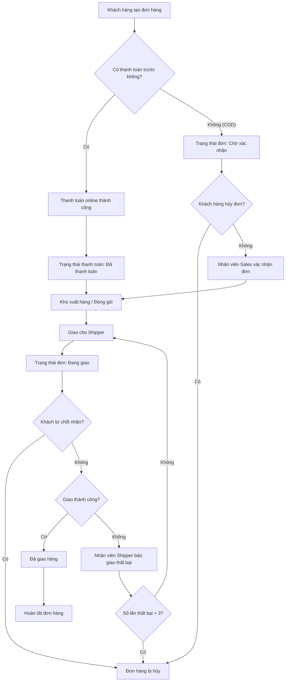

# Biểu đồ luồng xử lý đơn hàng (Order Processing Flow)

> **Mô tả quy trình chi tiết thiết lập trên hệ thống:**
> Sau khi khách hàng thiết lập đơn hàng trên Storefront (Web), hệ thống kiểm tra hình thức thanh toán. Thao tác tiếp theo sẽ trải qua sự phối hợp của ba Role (Phiên bản hệ thống chặt chẽ):
> 
> 1. **Khách hàng / Hệ thống**: Nếu thanh toán online thành công, đơn được đẩy thẳng xuống kho. Nếu là thanh toán khi nhận hàng (COD), đơn vào trạng thái chờ. Lúc này Khách hàng có thể tự do Hủy đơn.
> 2. **Nhân viên Bán hàng (Sales)**: Có nhiệm vụ xác nhận (Approve) đơn hàng đang chờ rỗng thành công, khóa quyền hủy đơn của Khách. Sau đó chuyển phiếu gửi Kho.
> 3. **Nhân viên / Đối tác Vận chuyển (Shipper)**: Chỉ có Shipper mới được quyền ấn cập nhật hoàn thành đối với đơn hàng. Trong quá trình giao, nếu đi vắng, Shipper được đánh dấu giao thất bại. Quá 3 lần sẽ Hủy khóa đơn. Khi giao được tới tay khách và nhận tiền COD, Shipper xác nhận "Hoàn tất". Hệ thống ngay lúc này mới Ghi nhận Doanh thu.