# Sơ đồ Thực thể Liên kết (ERD) - PowerTech System

Dưới đây là sơ đồ ERD (Entity-Relationship Diagram) tổng quan thể hiện cấu trúc cơ sở dữ liệu của hệ thống PowerTech. Sơ đồ này mô tả các thực thể cốt lõi, sự kiện kinh doanh và mối quan hệ phân quyền/vai trò giữa chúng.

> **Mẹo**: Nếu bạn sử dụng trình duyệt hoặc IDE có hỗ trợ plugin render Markdown (như GitHub, GitLab, VS Code với extension Mermaid), sơ đồ khối sẽ tự động hiển thị trực quan.

```mermaid
erDiagram
    %% ==========================================
    %% 1. IDENTITY & USER ROLES (Phân quyền)
    %% ==========================================
    ApplicationUser {
        nvarchar Id PK
        nvarchar FullName
        nvarchar Email
        nvarchar PhoneNumber
        int Points
    }
    AspNetRoles {
        nvarchar Id PK
        nvarchar Name "Admin/Sales/Shipper/Warehouse"
    }
    AspNetUserRoles {
        nvarchar UserId FK
        nvarchar RoleId FK
    }
    UserAddress {
        int Id PK
        nvarchar UserId FK
        nvarchar ReceiverName
        nvarchar AddressLine
        bit IsDefault
    }

    ApplicationUser ||--o{ AspNetUserRoles : "assigned_to"
    AspNetRoles ||--o{ AspNetUserRoles : "has_users"
    ApplicationUser ||--o{ UserAddress : "owns"


    %% ==========================================
    %% 2. PRODUCT CATALOG (Nghiệp vụ Hàng hoá)
    %% ==========================================
    Category {
        int Id PK
        nvarchar Name
        int ParentCategoryId FK "Self-referencing"
    }
    Brand {
        int Id PK
        nvarchar Name
        nvarchar LogoUrl
    }
    Product {
        int Id PK
        int CategoryId FK
        int BrandId FK
        nvarchar SKU
        nvarchar Name
        decimal Price
        int StockQuantity "Tồn kho Cache"
    }
    ProductImage {
        int Id PK
        int ProductId FK
        nvarchar ImageUrl
    }
    SpecificationDefinition {
        int Id PK
        nvarchar Name "Eg: RAM, CPU"
    }
    ProductSpecification {
        int ProductId FK
        int SpecDefinitionId FK
        nvarchar Value "Eg: 16GB, Core i7"
    }

    Category ||--o{ Category : "has_subcategories"
    Category ||--o{ Product : "contains"
    Brand ||--o{ Product : "manufactures"
    Product ||--o{ ProductImage : "has_images"
    Product ||--o{ ProductSpecification : "has"
    SpecificationDefinition ||--o{ ProductSpecification : "defines"


    %% ==========================================
    %% 3. SALES & ORDERS (Nghiệp vụ Bán hàng)
    %% ==========================================
    Order {
        int Id PK
        nvarchar UserId FK
        nvarchar AssignedToUserId FK "Shipper/Sales"
        int CouponId FK
        nvarchar OrderStatus "Pending/Shipping/Completed"
        nvarchar OrderType "Online/POS"
        decimal TotalAmount
    }
    OrderItem {
        int Id PK
        int OrderId FK
        int ProductId FK
        int Quantity
        decimal UnitPrice "Snapshot giá bán"
        nvarchar ProductSkuSnapshot "Snapshot mã sản phẩm"
    }
    Payment {
        int Id PK
        int OrderId FK
        nvarchar PaymentMethod "COD/VNPay"
        nvarchar PaymentStatus
        nvarchar TraceId
    }
    Coupon {
        int Id PK
        nvarchar Code
        decimal Value
        int UsageLimit
        int UsedCount
    }

    ApplicationUser ||--o{ Order : "places_order (Customer)"
    ApplicationUser ||--o{ Order : "processes/delivers (Staff)"
    Order ||--|{ OrderItem : "contains"
    Product ||--o{ OrderItem : "is_ordered_as"
    Order ||--o| Payment : "is_paid_via"
    Coupon ||--o{ Order : "applied_to"


    %% ==========================================
    %% 4. INVENTORY & WAREHOUSE (Nghiệp vụ Kho)
    %% ==========================================
    StockTransaction {
        int Id PK
        int ProductId FK
        nvarchar PerformedByUserId FK
        nvarchar TransactionType "Import/Export/Sale/Return"
        int BeforeQuantity
        int Quantity "Lượng thay đổi"
        int AfterQuantity
    }

    Product ||--o{ StockTransaction : "logs_changes_for"
    ApplicationUser ||--o{ StockTransaction : "performed_by (Warehouse)"


    %% ==========================================
    %% 5. CUSTOMER CARE & SUPPORT (CSKH)
    %% ==========================================
    Review {
        int Id PK
        int ProductId FK
        nvarchar UserId FK
        tinyint Rating
        bit IsApproved
    }
    SupportTicket {
        int Id PK
        nvarchar TicketCode
        nvarchar UserId FK
        nvarchar AssignedToUserId FK
        int OrderId FK "Optional"
        nvarchar Status
    }
    TradeInRequest {
        int Id PK
        nvarchar UserId FK "Optional"
        nvarchar CustomerName
        nvarchar DeviceCondition
        decimal OfferedPrice
        nvarchar Status
    }

    ApplicationUser ||--o{ Review : "writes"
    Product ||--o{ Review : "receives"
    ApplicationUser ||--o{ SupportTicket : "opens_ticket (Customer)"
    ApplicationUser ||--o{ SupportTicket : "resolves_ticket (Support Staff)"
    Order ||--o{ SupportTicket : "has_issues_in"
    ApplicationUser ||--o{ TradeInRequest : "requests"

```

## Giải thích Luồng Nghiệp Vụ Chính Trong ERD

### 1. Luồng Bán hàng (Order Flow)
- **Khách hàng (`ApplicationUser`)** tạo một **`Order`**. 
- Hệ thống nhân bản giá và thông tin sản phẩm từ **`Product`** để thả vào **`OrderItem`** (Đây là cơ chế Snapshot chống sai lệch dữ liệu tài chính).
- Hoá đơn có thể áp dụng 1 **`Coupon`** và sinh ra 1 **`Payment`** để lưu log thanh toán (VNPay).
- **Nhân viên Sales hoặc Shipper (`ApplicationUser`)** có thể được gắn (Assign) vào hoá đơn đó để xử lý thông qua trường `AssignedToUserId` trong bảng `Order`.

### 2. Luồng Kiểm soát Kho (Ledger Flow)
- Kho là một nghiệp vụ nhạy cảm, số tồn kho `StockQuantity` trong bảng `Product` là một con số có thể bị sai nếu thao tác đè lên nhau (Concurrency).
- Do đó, mọi hành động nhập (Import), bán ra (Sale), trả hàng (Return) do **Thủ kho (`ApplicationUser` role Warehouse)** thực hiện đều được lưu vết lại thành từng dòng trong **`StockTransaction`**.

### 3. Luồng CSKH (Support Flow)
- Khi máy hỏng hoặc giao sai hàng, Khách hàng tạo **`SupportTicket`**. Thẻ này có thể liên kết trực tiếp vào 1 **`Order`** cũ để đối soát. Phân hệ Support có nhiệm vụ đọc và đóng các Ticket này.
- Khi muốn đổi đồ cũ lấy đồ mới, Khách thực hiện **`TradeInRequest`** trên Web. Hệ thống sẽ lưu hình ảnh thiết bị cũ để kỹ thuật viên tự định giá và chào giá lại cho khách.

